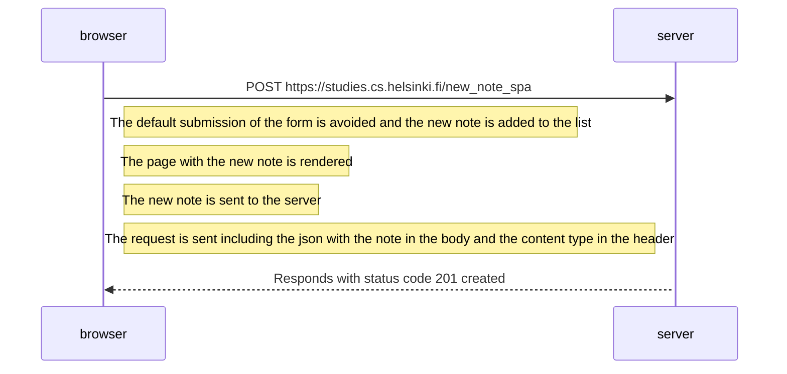

## Diagram Context

Sequence diagram describing the situation in which the user creates a new note in the single page notes application at https://studies.cs.helsinki.fi/exampleapp/spa

```mermaid

sequenceDiagram
    participant browser
    participant server

    browser->>server: POST https://studies.cs.helsinki.fi/new_note_spa
    activate server
    Note right of browser: The default submission of the form is avoided and the new note is added to the list
    Note right of browser: The page with the new note is rendered
    Note right of browser: The new note is sent to the server
    Note right of browser: The request is sent including the json with the note in the body and the content type in the header
    server-->>browser: Responds with status code 201 created
```